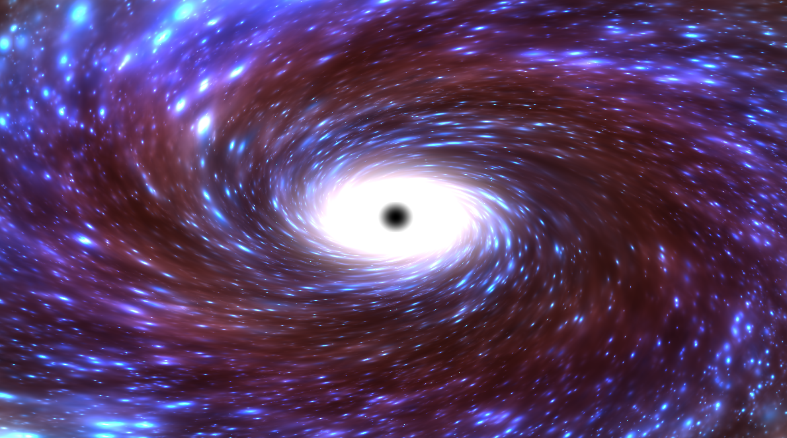

# 太极图形课S1-L5
给课程repo例子里的galaxy加了个黑洞，虽然黑洞质感还不太好 =v= 后续学习可能会想办法把他做成谜团大的效果（

## 成功效果展示
这里可以展示这份作业（项目）run起来后的可视化效果，可以让其他人更直观感受到你的工作


## 整体结构（Optional）
脉络清晰的结构能完整展示你的设计思想，以及实现方式，方便读者快读代入，建议可以在repo的目录中包含如下内容：
这个部分希望大家可以大作业中加入，小作业中可以选择性加入（如果不加也是OK的）
```
-LICENSE
-|data
-README.MD
-main.py
-handy_shader_functions.py
```

## 运行方式
`python3 main.py`
